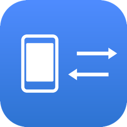
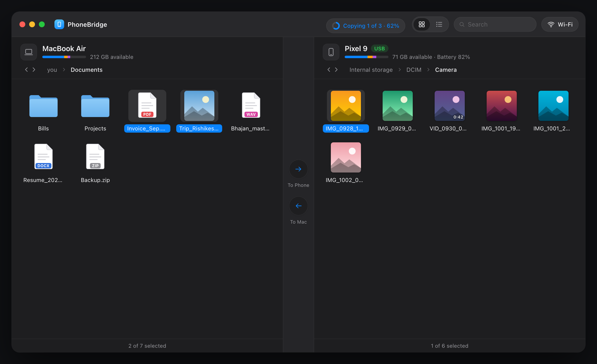
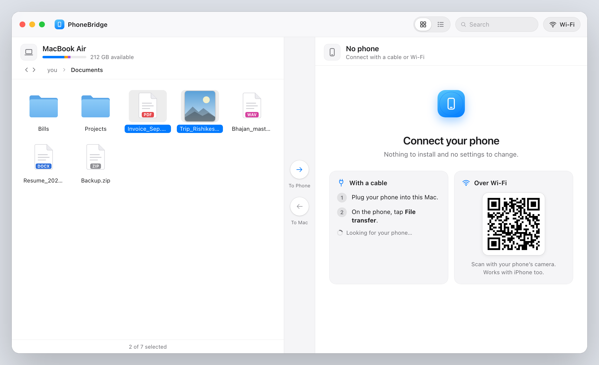
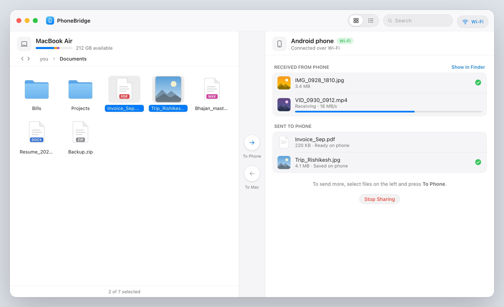
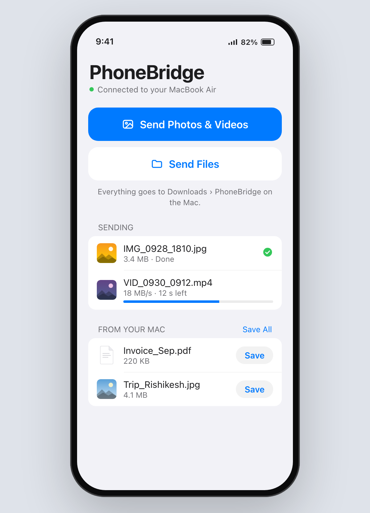

<div align="center">



# PhoneBridge

**Move files between any Android phone and your Mac, by cable or over Wi-Fi.**

No USB debugging. No app on the phone. No account, no cloud. Free and open source.

[**⬇ Download PhoneBridge.dmg**](https://github.com/chatwithme004-lgtm/PhoneBridge/releases/latest/download/PhoneBridge.dmg) · [How to use](#how-to-use) · [Troubleshooting](#troubleshooting) · [Build from source](#build-from-source)



</div>

---

## Why PhoneBridge?

Google stopped offering **Android File Transfer** for Mac, and macOS can't open an Android phone on its own. Most alternatives make you turn on Developer options, install an app on the phone, or upload everything to the cloud first.

PhoneBridge talks to the phone the same way Windows does. Plug it in, tap **File transfer** on the phone, and your files appear in a window that works like Finder.

## Features

- **Cable, two steps.** Plug the phone in and tap **File transfer**. Works with Samsung, Pixel, Motorola, Xiaomi / Redmi / POCO, OnePlus, OPPO, vivo, realme and other Android phones. USB debugging is not needed.
- **Wi-Fi, one step.** Scan a QR code with the phone's camera. A page opens in the phone's browser where you can send photos and files to the Mac and save files from it. **Works with iPhone too.**
- **Feels like Finder.** Icon and list views, photo and video thumbnails, sorting, search, back and forward, a path bar, right-click menus and keyboard shortcuts.
- **Copy both ways.** Use drag and drop or the arrow buttons, with live progress, speed, and a Stop button.
- **Safe by default.** It never overwrites a file; a name clash keeps both. Files deleted on the Mac go to the Trash, and deleting on the phone always asks first.
- **Fast.** About 40 MB/s each way over USB. A Camera folder with 800 photos lists in under a second.
- **Private.** Everything stays between your Mac and your phone. No accounts, no cloud, no tracking.
- **Light and dark mode.** It follows your Mac.

<p align="center">
  
  
</p>

## Download and install

1. [Download **PhoneBridge.dmg**](https://github.com/chatwithme004-lgtm/PhoneBridge/releases/latest/download/PhoneBridge.dmg) (always the newest version), or pick a version from [Releases](../../releases).
2. Open it and drag **PhoneBridge** into **Applications**.
3. **The first time you open it**, macOS may say it can't check the app. This is because PhoneBridge isn't notarized by Apple yet. Open **System Settings › Privacy & Security**, scroll down and click **Open Anyway**. You only need to do this once.

**Requirements:** a Mac with Apple Silicon (M1 or later). Tested on macOS 26.

## How to use

### With a cable

1. Plug your phone into the Mac. Use a port on the Mac itself, not a hub.
2. On the phone, pull down the notifications, tap **Charging this device via USB**, and choose **File transfer**. Samsung calls it **Transferring files**.
3. Your phone's files open on the right. Select items and press **To Mac** or **To Phone**, or drag them across.

If the phone is locked, PhoneBridge asks you to unlock it, because Android hides your files until you do.

### Over Wi-Fi

1. Connect the phone to the **same Wi-Fi** as the Mac.
2. In PhoneBridge, scan the QR code with the phone's camera and open the link.
3. On the phone, tap **Send Photos & Videos** or **Send Files**. They arrive in **Downloads › PhoneBridge** on the Mac.
4. To send files to the phone, select them on the Mac and press **To Phone**, then tap **Save** on the phone.

<p align="center"></p>

### Keyboard shortcuts

| Shortcut | Action |
|---|---|
| ⌘A | Select all |
| ⌘⌫ | Delete (moves to the Trash on the Mac) |
| ↩ | Rename |
| ⇧⌘N | New folder |
| ⇧⌘G | Go to folder |
| ⌘↑ / ⌘↓ | Parent folder / open |
| ⌘[ / ⌘] | Back / forward |
| ⇧⌘. | Show or hide hidden files |
| ⌘F | Search |

## Troubleshooting

| What you see | What to do |
|---|---|
| The phone charges but never offers **File transfer** | The cable probably only carries power. Try another cable, ideally the one that came with the phone. |
| **"The connection keeps dropping"** | Plug the phone straight into a port on the Mac, not a hub, keyboard or monitor. If it still happens, try another cable. |
| **"Unlock your phone"** | Unlock it. Your files appear by themselves. |
| **"Another app may be using the phone"** | Quit Android File Transfer, OpenMTP, Image Capture or Photos, then unplug and plug the phone in again. |
| Wi-Fi page says **"Can't reach the Mac"** | Put both devices on the same Wi-Fi. Guest and office networks often block devices from seeing each other. |
| Wi-Fi link says **"This link has expired"** | PhoneBridge was restarted or sharing was stopped. Scan the new QR code. |

PhoneBridge keeps a log at `~/Library/Logs/PhoneBridge.log`. Please attach it when you [open an issue](../../issues).

## How it works

- **Cable.** PhoneBridge includes its own **MTP** client written in Python (using `pyusb` and `libusb`). MTP is the protocol behind the phone's **File transfer** mode, so nothing has to be turned on in the phone. Some phones, such as Xiaomi models, look like a camera to macOS, and macOS's photo-import service (`ptpcamerad`) grabs them. PhoneBridge pauses that service while it connects, and macOS restarts it automatically afterwards.
- **Backup route.** If a phone has USB debugging on but isn't in File transfer mode, PhoneBridge falls back to `adb`.
- **Wi-Fi.** A small web server runs on your local network only while sharing is on. Every request must carry the one-time key from the QR code. It can only save incoming files to `~/Downloads/PhoneBridge` and hand out files you chose on the Mac. Stopping sharing kills the link.
- **The app.** A Flask server bound to `127.0.0.1` drives an HTML/JS interface inside a native macOS window (`pywebview`). Every action needs a secret that changes each launch, so other websites can't control it.

## Build from source

```bash
git clone https://github.com/chatwithme004-lgtm/PhoneBridge.git
cd PhoneBridge
python3 -m pip install -r requirements.txt
./scripts/get_tools.sh        # downloads adb and ffmpeg into tools/
python3 app.py                # development: open http://127.0.0.1:5590
./build_dmg.sh                # builds dist/PhoneBridge.app and PhoneBridge.dmg
```

| File | What it does |
|---|---|
| `mtp.py` | MTP client: list, download, upload, rename, delete, thumbnails, battery and storage |
| `phones.py` | Watches USB, picks MTP or adb, keeps the connection healthy |
| `wifi.py` | The QR-code Wi-Fi sharing server |
| `app.py` | Local API used by the window: listings, copy jobs, thumbnails |
| `launcher.py` | Opens the native macOS window |
| `templates/` | The Mac window (`index.html`) and the phone's Wi-Fi page (`phone.html`) |

## Known limitations

- Over Wi-Fi the Mac can't browse the whole phone, because a web page isn't allowed to read the phone's storage. You pick files on the phone instead.
- Phones can't send whole folders over Wi-Fi (a browser limit). Folders sent from the Mac are zipped automatically.
- One phone at a time.
- The download is for Apple Silicon Macs only, for now.
- The app isn't notarized yet, so the first launch needs **Open Anyway**.

## Contributing

Bug reports and pull requests are welcome. If a phone isn't detected, please include its make and model and your `~/Library/Logs/PhoneBridge.log`.

## Credits and licences

PhoneBridge is released under the licence in [LICENSE](LICENSE).

The app download also includes:
- [FFmpeg](https://ffmpeg.org) (GPL), used for video thumbnails;
- `adb` from the [Android SDK Platform-Tools](https://developer.android.com/tools/releases/platform-tools);
- [libusb](https://libusb.info) (LGPL-2.1);
- [pyusb](https://github.com/pyusb/pyusb), [Flask](https://flask.palletsprojects.com), [Pillow](https://python-pillow.org), [segno](https://github.com/heuer/segno) and [pywebview](https://pywebview.flowrl.com).

Each of these is covered by its own licence.

PhoneBridge is not affiliated with Google, Apple, Samsung, Motorola or Xiaomi. Android is a trademark of Google LLC. Mac and macOS are trademarks of Apple Inc.
